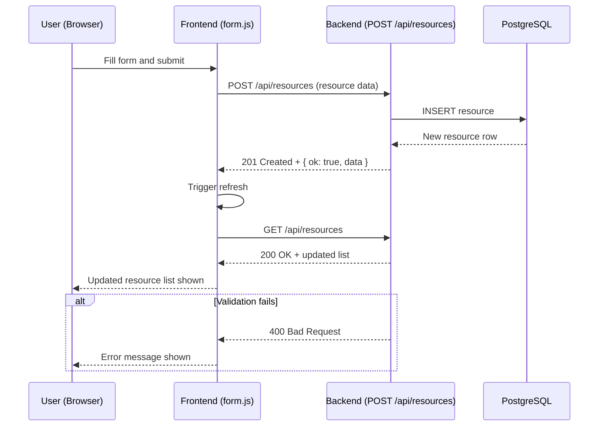
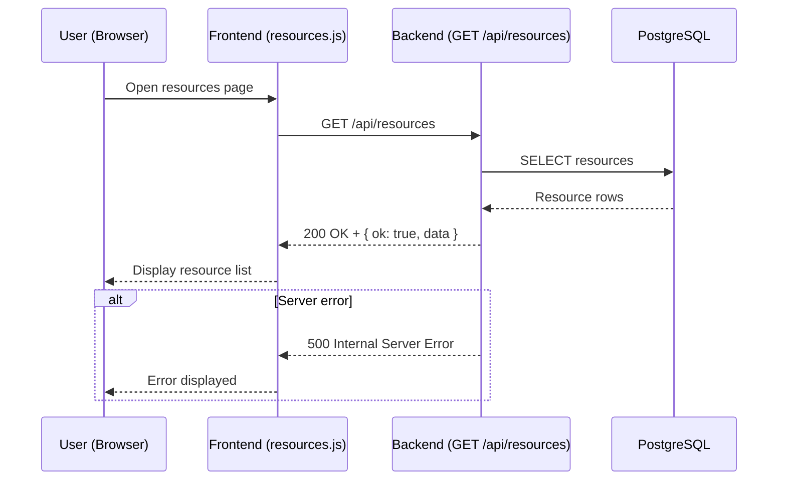
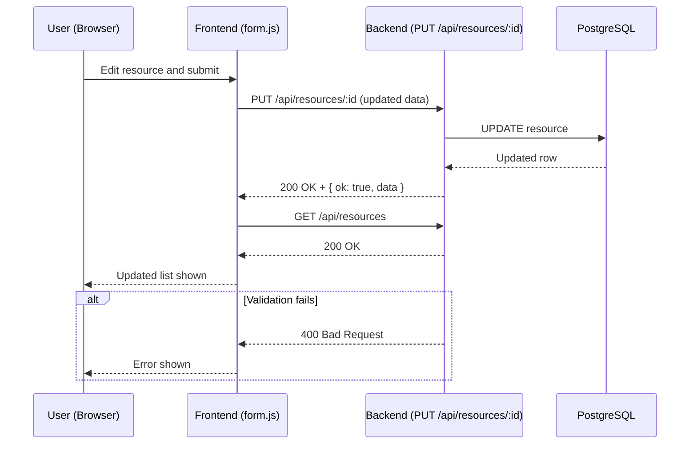
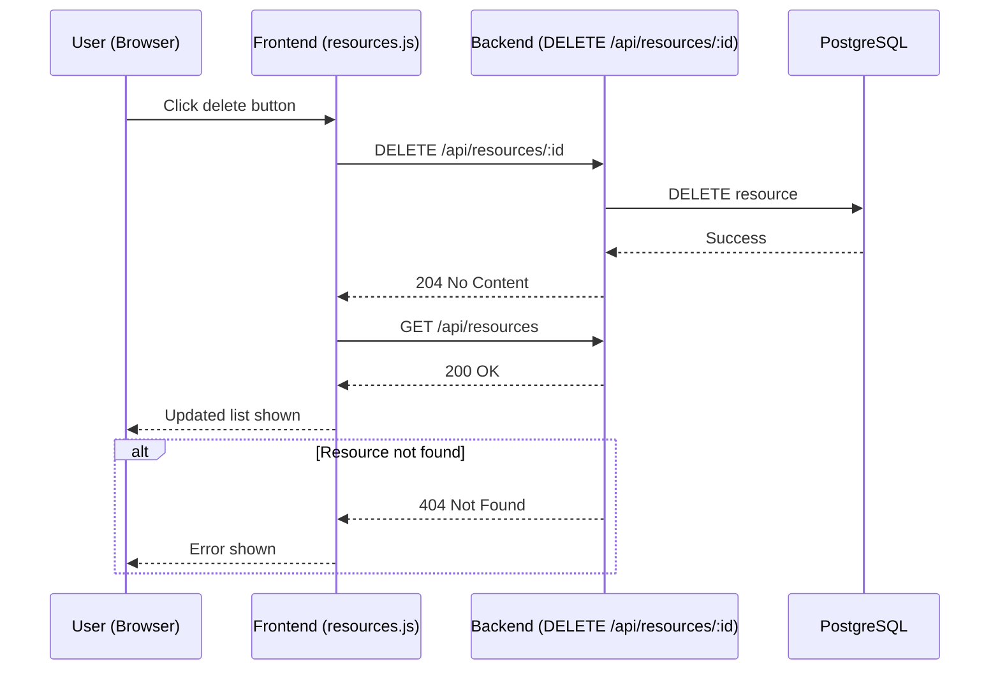

## CREATE (C)

```mermaid
sequenceDiagram
    participant U as User (Browser)
    participant F as Frontend (form.js)
    participant R as Backend (POST /api/resources)
    participant DB as PostgreSQL

    U->>F: Fill form and submit
    F->>R: POST /api/resources (resource data)
    R->>DB: INSERT resource
    DB-->>R: New resource row
    R-->>F: 201 Created + { ok: true, data }

    F->>F: Trigger refresh
    F->>R: GET /api/resources
    R-->>F: 200 OK + updated list
    F-->>U: Updated resource list shown

    alt Validation fails
        R-->>F: 400 Bad Request
        F-->>U: Error message shown
    end
```

## READ (R)

```mermaid
sequenceDiagram
    participant U as User (Browser)
    participant F as Frontend (resources.js)
    participant R as Backend (GET /api/resources)
    participant DB as PostgreSQL

    U->>F: Open resources page
    F->>R: GET /api/resources
    R->>DB: SELECT resources
    DB-->>R: Resource rows
    R-->>F: 200 OK + { ok: true, data }

    F-->>U: Display resource list

    alt Server error
        R-->>F: 500 Internal Server Error
        F-->>U: Error displayed
    end
```

## UPDATE (U)

```mermaid
sequenceDiagram
    participant U as User (Browser)
    participant F as Frontend (form.js)
    participant R as Backend (PUT /api/resources/:id)
    participant DB as PostgreSQL

    U->>F: Edit resource and submit
    F->>R: PUT /api/resources/:id (updated data)
    R->>DB: UPDATE resource
    DB-->>R: Updated row
    R-->>F: 200 OK + { ok: true, data }

    F->>R: GET /api/resources
    R-->>F: 200 OK
    F-->>U: Updated list shown

    alt Validation fails
        R-->>F: 400 Bad Request
        F-->>U: Error shown
    end
```

## DELETE (D)

```mermaid
sequenceDiagram
    participant U as User (Browser)
    participant F as Frontend (resources.js)
    participant R as Backend (DELETE /api/resources/:id)
    participant DB as PostgreSQL

    U->>F: Click delete button
    F->>R: DELETE /api/resources/:id
    R->>DB: DELETE resource
    DB-->>R: Success
    R-->>F: 204 No Content

    F->>R: GET /api/resources
    R-->>F: 200 OK
    F-->>U: Updated list shown

    alt Resource not found
        R-->>F: 404 Not Found
        F-->>U: Error shown
    end
```
